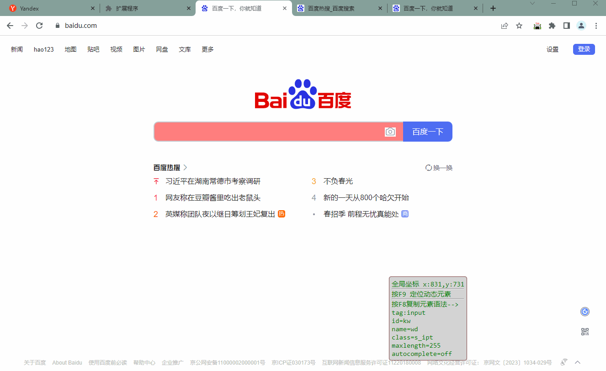

# 
- 

#  😈 元素自动定位助手 介绍 

 **元素自动定位助手**   来自骚神库   Drissionpage 库 元素语法定位谷歌浏览器插件 ， 辅助 新手快速入门 Drissionpage库，能避免使用DP库中遇到的各种关于元素定位的疑难杂症，还有更多实操教学案例..

---

## 元素自动定位助手 4.6

1. 修复少量 bug
2. 增加 F9定位动态元素功能

---
## 元素自动定位助手 4.5

1. 信息显示栏 变成跟随鼠标移动模式
2. 鼠标悬浮在元素上方，会高亮元素背景色
3. 信息显示栏 自适应文本大小 自动检测浏览器边界碰撞
4. 信息显示栏 增加 当前坐标信息

---